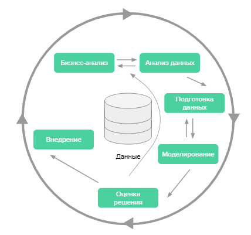

# Домашняя работа
> *Решил попробовать выполнить в Markdown, поскольку хочу получше его изучить. Мне кажется, что он лучше подходит для универсальной презентации данных на экране, которые **не будут** распечатаны впоследствии*
## Обозначение задания:
---
Вам нужно построить модель, **предсказывающую**, оформит ли пользователь заказ, сформированный в корзине интернет-магазина.

В качестве источников данных доступно несколько систем, включая:

- информацию о пользователях и истории их товаров,
- информацию о товарах,
- информацию о корзине.

**Разложите задачу по CRISP-DM. Для каждого шага сформулируйте:**

- что планируете на нём делать,
- каких результатов от него ожидаете,
- какие роли специалистов вам нужны на этом шаге.

### Пример — business understanding.
---
На этом шаге планируется выявить основную боль бизнеса.
- Вывести метрику конверсии корзины в покупку. Определить типичные значения, проверить наличие сезонности.
- Определить, как заказчик видит использование полученной модели, сформулировать минимально необходимое качество.
- Оценить ожидаемый эффект от такой модели и сравнить его с ожидаемыми трудозатратами.

*Для успешного выполнения этого этапа потребуется аналитик и владелец продукта.*
## Выполнение задания:
---

### Методология
---
В качестве представления идеи **CRISP-DM** представлялось такое изображение:

   
Если же расписать более детально - мы можем представить его в следующем виде: 

| Business Understanding | Data Understanding | Data Preparetion | Modeling | Evaluation | Deployment |
| --- | --- | --- | --- | --- | --- |
| Determine Business Objectives | Collect Initial Data | Select Data | Select Modeling Techniques | Evaluate Results | Plan Deployment |
| Assess Situation | Describe Data | Clean Data | Generate Test Design | Review Process | Plan Monitoring and Maintenance |
| Determine Data Mining Goals | Explore Data | Construct Data | Build Model | Deterrnine Next Steps | Produce Final Report |
| Produkt Project Plan | Verify Data Quality | Integrate Data | Assess Model | | Review Project |
| | | Format Data | | | |

### Решение:

| Этап | План действий | Результат | Роли |
| --- | --- | --- | ---|
| 1. Business Understanding | <ul><li>Собираем информацию а что за бизнес</li><li>Узнаем как модель и кем будет использоваться</li><li>Согласовываем видение итогового результата</li><li>Получаем доступ к описанным выше ресурсам</li><li>Создаем план проекта</li></ul> | Готовый план проекта | BI специалист, Заказчик, Владелец продукта 
| 2. Data Understanding | <ul><li>Собрать данные отовсюду</li><li>Описать их, получить связи</li><li>Проверить качество данных, выявить ошибки</li></ul> | Собранные данные с документацией и планом их обработки | Аналитик данных, Data-Engineer, ETL-специалист
| 3. Data Preparation | <ul><li>Выбрать данные</li><li>Очистить</li><li>Насытить, если есть чем</li><li>Подготовить для моделирования</li></ul> | Очищенный, насыщенный датасет, готовый к загрузке в систему моделирования | ETL-специалист, Аналитик Данных, DS-специалист
| 4. Modeling | <ul><li>Выбираем метод</li><li>Строим модель</li><li>Оцениваем</li><li>Описываем результат</li></ul> | Модель, предсказывающая оформит ли пользователь заказ, сформированный в корзине интернет-магазина. | DS-специалист
| 5. Evaluation | <ul><li>Оцениваем результат</li><li>Проверяем его применимость</li><li>Согласовываем с заказчиком итог работы</li></ul> | Информаци о требуемых улучшениях для повторения цикла, или подтверждение работоспособности модели | DS-специалист, Аналитик данных, CDO
| 6. Deployment | <ul><li>Создаем план внедрения</li><li>План техобслуживания</li><li>Проводим итоговый разбор</li></ul> | Документация для заказчика, его разработчиков по модели и деталям работы с ней. | Разрабы, BI специалист, Заказчик, Владелец продукта, Аналитик данных DS-специалист